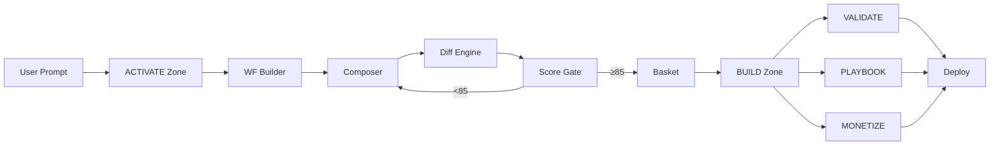

<div align="center">

# 🧬 PromptOS

### Kinetic Autopoiesis Architecture

**The AI Vibe Coding Agent Build Instruction Set — v1.0 · June 2026**

<br>

[](#-live-demo)
[](#-vercel-deployment)
[](#-license)
[](#)
[](#)

---

<br>

> *"A hybrid architecture blending **Kinetic Spatial** motion, **Autopoietic** iterative canvas, and **Glass Depth** spatial layers into one unified build system."*

<br>

**⚡ [Live Demo](https://marktantongco.github.io/promptos-showcase/)** · **📦 [NPM Package](#-installation)** · **🎯 [Quick Start](#-quick-start)** · **📖 [Docs](#-architecture)**

<br>


</div>

---

## 📑 Table of Contents

<details>
<summary><strong>🚀 Quick Navigation</strong></summary>

- [Overview](#-overview)
- [Architecture](#-architecture)
- [4-Skill Stack](#-4-skill-stack)
- [7-Phase Pipeline](#-7-phase-pipeline)
- [5-Zone Architecture](#-5-zone-architecture)
- [Tech Stack](#-tech-stack)
- [Skill Normalization](#-skill-normalization)
- [Installation](#-installation)
- [Known Errors](#-known-errors--fixes)
- [OmO Integration](#-omo-ecosystem-integration)
- [Keyboard Shortcuts](#-keyboard-shortcuts)
- [Deployment](#-deployment)
- [Contributing](#-contributing)
- [License](#-license)

</details>

---

## 🧠 Overview

PromptOS is a **next-generation AI build instruction set** that transforms how developers create, iterate, and ship AI-powered applications. Built on the **Kinetic Autopoiesis** philosophy, it combines:

```
┌─────────────────────────────────────────────────────────────┐
│                                                             │
│   ╔═══════════════════════════════════════════════════╗    │
│   ║           K I N E T I C   A U T O P O I E S I S     ║    │
│   ╠═══════════════════════════════════════════════════╣    │
│   ║                                                     ║    │
│   ║  ◆ Kinetic Spatial     ████████████████░░░░  40%   ║    │
│   ║  ◆ Autopoietic Canvas  ██████████████░░░░░░  35%   ║    │
│   ║  ◆ Glass Depth         ██████████░░░░░░░░░░  25%   ║    │
│   ║                                                     ║    │
│   ╚═══════════════════════════════════════════════════╝    │
│                                                             │
└─────────────────────────────────────────────────────────────┘
```

| Pillar | Weight | Description |
|--------|--------|-------------|
| 🎬 **Kinetic Spatial** | 40% | Motion-driven spatial interactions with 3-tier animation system |
| 🔄 **Autopoietic Canvas** | 35% | Self-iterating build loops with quality scoring ≥85/100 |
| 🪟 **Glass Depth** | 25% | Z-axis layered glass morphism with spatial hierarchy |

---

## 🏗️ Architecture

### System Schematic

```
                         ╔══════════════════════╗
                         ║      USER PROMPT      ║
                         ╚══════════╦═══════════╝
                                    ║
                    ┌───────────────╨───────────────┐
                    │                               │
                    ▼                               ▼
            ╔═══════════════╗              ╔═══════════════╗
            ║   ACTIVATE    ║              ║    SILENT     ║
            ║     ZONE      ║◄────────────►║   PROTOCOL    ║
            ║   #4DFFFF     ║              ║   (HERMES)    ║
            ╚═══════╦═══════╝              ╚═══════════════╝
                    ║
                    ▼
    ╔═══════════════════════════════════════════════╗
    ║              WORKFLOW BUILDER                  ║
    ╠═══════════╦═══════════╦═══════════╦═══════════╣
    ║           ║           ║           ║           ║
    ▼           ▼           ▼           ▼           ║
┌────────┐ ┌────────┐ ┌────────┐ ┌────────┐       ║
│COMPOSER│─▶│  DIFF  │─▶│ SCORE  │─▶│ BASKET │       ║
└────────┘ └────────┘ └────────┘ └────────┘       ║
                                    ║              ║
                    ╔═══════════════╩═══════════════╣
                    ║            BUILD              ║
                    ║            ZONE               ║
                    ║          #FF6B00              ║
                    ╚═══════════════╦═══════════════╝
                                    ║
                    ┌───────────────┼───────────────┐
                    │               │               │
                    ▼               ▼               ▼
            ╔═══════════╗   ╔═══════════╗   ╔═══════════╗
            ║ VALIDATE  ║   ║ PLAYBOOK  ║   ║ MONETIZE  ║
            ║   ZONE    ║   ║   ZONE    ║   ║   ZONE    ║
            ║  #22c55e  ║   ║  #FFB000  ║   ║  #FFD700  ║
            ╚═══════════╝   ╚═══════════╝   ╚═══════════╝
```

### Data Flow



---

## 🎯 4-Skill Stack

The core engine. Four complementary skills, each weighted by influence:

<div align="center">

| # | Skill | Weight | Phase | Role | Output |
|:-:|-------|:------:|:-----:|------|--------|
| 1 | 🎬 **Framer Motion Animator** | `35%` | P2 | Motion Vocabulary Architect | `src/lib/motion.ts` |
| 2 | 🎨 **UI/UX Pro Max** | `30%` | P1 | Design Intelligence Governor | `design-system/MASTER.md` |
| 3 | 🔄 **Stitch Loop** | `20%` | P3 | Iterative Refinement Engine | `.stitch/DESIGN.md` |
| 4 | 📦 **21st.dev Registry** | `15%` | P1b | Component Supply on Demand | Team Library |

</div>

### Motion Vocabulary — 3-Tier System

```
┌─────────────────────────────────────────────────────────────┐
│                     MOTION HIERARCHY                         │
├─────────────────────────────────────────────────────────────┤
│                                                             │
│   MACRO ─────── 400-600ms ─────── Page transitions          │
│   ████████████████████████████░░░  Route changes             │
│                                  Full-screen overlays        │
│                                                             │
│   MESO ───────── 200-350ms ───── Component state            │
│   ████████████████████░░░░░░░░░░  Card expand                │
│                                  Modal open/close            │
│                                                             │
│   MICRO ──────── 80-150ms ────── Micro-interactions         │
│   ██████████░░░░░░░░░░░░░░░░░░░  Button hover               │
│                                  Icon bounce                 │
│                                                             │
└─────────────────────────────────────────────────────────────┘
```

### Spatial Architecture — 4 Depth Layers

```
┌──────────────────────────────────────────────────────┐
│  z-30  │ INTERACTION │ Modals, tooltips, overlays    │
│────────┼─────────────┼───────────────────────────────│
│  z-20  │   CONTENT   │ Main content area             │
│────────┼─────────────┼───────────────────────────────│
│  z-10  │   CONTEXT   │ Navigation, sidebars          │
│────────┼─────────────┼───────────────────────────────│
│   z-0  │  BACKGROUND │ Noise texture, animated orbs  │
└──────────────────────────────────────────────────────┘
```

---

## 🔧 7-Phase Pipeline

Each phase builds on the previous. From scaffold to deployment:

```
  PHASE    NAME                    OUTPUT                    GATE
  ─────    ────                    ──────                    ────
   P0  ──▶ Prerequisite        ──▶ Skills installed        ──▶ ✓
   P1  ──▶ Design System       ──▶ MASTER.md + tokens.css  ──▶ ✓
   P2  ──▶ Motion Vocabulary   ──▶ src/lib/motion.ts       ──▶ ✓
   P3  ──▶ Spatial Architecture──▶ src/lib/spatial.ts       ──▶ ✓
   P4  ──▶ Generation Seed     ──▶ .stitch/DESIGN.md       ──▶ ✓
   P5  ──▶ Iterative Refinement──▶ Audit score ≥ 85/100    ──▶ ≥85
   P6  ──▶ Integration Wiring  ──▶ Provider + HERMES       ──▶ ✓
```

<details>
<summary><strong>📋 Phase Details (Click to expand)</strong></summary>

| Phase | Inputs | Outputs | Quality Gate |
|-------|--------|---------|-------------|
| **P0** | — | 4 skills installed | Installation success |
| **P1** | Project scaffold | `design-system/MASTER.md` + `tokens.css` | Design system validation |
| **P2** | Design tokens | `src/lib/motion.ts` (3-tier system) | Motion token coverage |
| **P3** | Motion system | `src/lib/spatial.ts` (4 layers) | Z-index hierarchy check |
| **P4** | Design + Motion | `.stitch/DESIGN.md` + `.stitch/SITE.md` | Config completeness |
| **P5** | All configs | Audit score report | Score ≥ 85/100 |
| **P6** | Validated build | PromptOS Provider + HERMES Protocol | Integration tests |

</details>

---

## 🗺️ 5-Zone Architecture

Each zone serves a distinct purpose in the PromptOS workflow:

<table>
<tr>
<td width="20%" align="center">

**⚡ ACTIVATE**
`#4DFFFF`

</td>
<td width="20%" align="center">

**🔧 BUILD**
`#FF6B00`

</td>
<td width="20%" align="center">

**✅ VALIDATE**
`#22c55e`

</td>
<td width="20%" align="center">

**📋 PLAYBOOK**
`#FFB000`

</td>
<td width="20%" align="center">

**💰 MONETIZE**
`#FFD700`

</td>
</tr>
<tr>
<td>

- Modifiers
- Sauces
- Workflows
- Silent Protocol

</td>
<td>

- WF Builder
- Diff Engine
- Score Gate
- Basket

</td>
<td>

- Lint Rules
- Quality Gates
- A11y Checks
- Visual Regression

</td>
<td>

- Animal Modes
- Mode Chains
- Skills Catalog
- Recipes

</td>
<td>

- Frameworks
- Templates
- Recipes
- Export

</td>
</tr>
</table>

### Animal Modes

```
🦅 Eagle ─── Architecture ──── "See the whole system"
    │
    ▼
🦉 Owl ───── Analysis ──────── "Understand deeply"
    │
    ▼
🐜 Ant ───── Detail ────────── "Inspect every piece"
    │
    ▼
🦫 Beaver ── Build ─────────── "Construct with precision"
```

---

## 🛠️ Tech Stack

<div align="center">

| Technology | Version | Purpose |
|-----------|---------|---------|
| ⚡ **Next.js** | 16.1.3 | React framework (App Router, RSC) |
| 🔷 **TypeScript** | 5.x | Type-safe development |
| 🎨 **Tailwind CSS** | 4.x | Utility-first styling |
| 🧩 **shadcn/ui** | Latest | Accessible components |
| 🎬 **Framer Motion** | 11.x | Production animations |
| 🐻 **Zustand** | 5.x | State management |
| 🗄️ **Supabase** | Latest | PostgreSQL backend |
| ◆ **Prisma** | 6.x | Type-safe ORM |

</div>

---

## 📦 Skill Normalization

All skills use a **unified install format**:

```bash
npx skills add <owner>/<repo> --skill <skill-name>
```

### Core 4 Skills

```bash
# 🎨 UI/UX Pro Max — Design Intelligence Governor
npx skills add nextlevelbuilder/ui-ux-pro-max-skill --skill ui-ux-pro-max

# 📦 21st.dev Registry — Component Supply on Demand
npx skills add 21st-dev/registry --skill 21st-registry

# 🔄 Stitch Loop — Iterative Refinement Engine
npx skills add google-labs-code/stitch-skills --skill stitch-loop

# 🎬 Framer Motion Animator — Motion Vocabulary Architect
npx skills add patricio0312rev/skills --skill framer-motion-animator
```

### Extended Registry (11 more)

<details>
<summary><strong>📦 View All 15 Skills</strong></summary>

| # | Skill | Owner/Repo | Command |
|:-:|-------|-----------|---------|
| 1 | supanova-design-engine | uxjoseph/supanova-design-skill | `--skill supanova-design-engine` |
| 2 | supanova-full-output | uxjoseph/supanova-design-skill | `--skill supanova-full-output` |
| 3 | supanova-premium-aesthetic | uxjoseph/supanova-design-skill | `--skill supanova-premium-aesthetic` |
| 4 | landing-page-generator | uxjoseph/landing-page-generator | `--skill landing-page-generator` |
| 5 | nanobanana-visual | uxjoseph/content-marketing-team | `--skill nanobanana-visual` |
| 6 | design-skill | uxjoseph/ppt_team_agent | `--skill design-skill` |
| 7 | find-skills | vercel-labs/skills | `--skill find-skills` |
| 8 | frontend-design | anthropics/skills | `--skill frontend-design` |
| 9 | web-design-guidelines | vercel-labs/agent-skills | `--skill web-design-guidelines` |
| 10 | skill-creator | anthropics/skills | `--skill skill-creator` |
| 11 | caveman | juliusbrussee/caveman | `--skill caveman` |

</details>

---

## ⚡ Installation

### Prerequisites

```
✓ Node.js 20 LTS    ✓ npm 10+    ✓ Git
```

### Quick Start

```bash
# 1. Install Skill CLI
npm install -g @anthropic/skills-cli

# 2. Install Core Skills
npx skills add nextlevelbuilder/ui-ux-pro-max-skill --skill ui-ux-pro-max && \
npx skills add 21st-dev/registry --skill 21st-registry && \
npx skills add google-labs-code/stitch-skills --skill stitch-loop && \
npx skills add patricio0312rev/skills --skill framer-motion-animator

# 3. Scaffold Project
npx create-next-app@latest promptos-app --typescript --tailwind --eslint --app --src-dir

# 4. Initialize PromptOS
cd promptos-app && npx skills run promptos-init

# 5. Start Development
npm run dev
```

### Alternative: View the Showcase

```bash
# Clone the showcase
git clone https://github.com/marktantongco/promptos-showcase.git
cd promptos-showcase

# Open in browser
open index.html
```

---

## 🐛 Known Errors & Fixes

<table>
<tr>
<th width="10%">Severity</th>
<th width="35%">Issue</th>
<th width="55%">Workaround</th>
</tr>
<tr>
<td align="center"><code>HIGH</code></td>
<td>Skill install fails on Node 22 (<code>ERR_MODULE_NOT_FOUND</code>)</td>
<td>Use Node 20 LTS: <code>nvm use 20</code></td>
</tr>
<tr>
<td align="center"><code>MED</code></td>
<td>Stitch Loop audit hangs on 500+ files</td>
<td><code>stitch-loop --max-files 200</code></td>
</tr>
<tr>
<td align="center"><code>MED</code></td>
<td>HERMES Protocol not detecting zone context</td>
<td>Set <code>HERMES_ENABLED=true</code> in <code>.env.local</code></td>
</tr>
<tr>
<td align="center"><code>LOW</code></td>
<td>21st.dev publish fails silently</td>
<td><code>21st-registry --verbose</code> + re-auth</td>
</tr>
<tr>
<td align="center"><code>LOW</code></td>
<td>Motion tokens not applying to Framer Motion 11</td>
<td>Import tokens explicitly in component</td>
</tr>
</table>

---

## 🔗 OmO Ecosystem Integration

PromptOS plugs into the **oh-my-openagent** ecosystem:

<table>
<tr>
<td width="25%" align="center">

**🔌 Model Providers**
Anthropic · OpenAI
Google · Moonshot
Z.ai · MiniMax
GitHub Copilot
OpenCode Zen

</td>
<td width="25%" align="center">

**📡 MCP Servers**
Exa · Context7
Grep.app · LSP
AST-Grep · Playwright
Firecrawl · Git · GitHub

</td>
<td width="25%" align="center">

**🛠️ Dev Tools**
Hashline Edit · Tmux
LSP · Ralph Loop
Todo Enforcer
Session Tools
Background Agents

</td>
<td width="25%" align="center">

**🤖 Platforms**
OpenCode
Codex CLI
Claude Code
Pi

</td>
</tr>
</table>

### HERMES Silent Protocol

```
┌─────────────────────────────────────────────────┐
│            HERMES SILENT PROTOCOL                │
├─────────────────────────────────────────────────┤
│                                                  │
│  1. DETECT PHASE    ─── planning/building/...    │
│  2. CLUSTER INTENT  ─── arch/impl/quality/...    │
│  3. SUGGEST MODE    ─── 🦅/🦉/🐜/🦫             │
│  4. FLOAT BADGE     ─── spring animation         │
│  5. DEVIL'S ADVOCATE── when confidence < 70%    │
│                                                  │
└─────────────────────────────────────────────────┘
```

### Keyboard Shortcuts

| Shortcut | Action | Zone |
|----------|--------|------|
| `⌘ + K` | Command Palette | All |
| `⌘ + B` | Basket | BUILD |
| `ESC` | Close Overlays | All |
| `← →` | Zone Navigation | All |

---

## 🚀 Deployment

### GitHub Pages

```bash
# Create repo
gh repo create marktantongco/promptos-showcase --public --source=. --push

# Enable GitHub Pages
gh api repos/marktantongco/promptos-showcase/pages -X POST -f build_type=legacy -f source.branch=main -f source.path=/

# Deploy
git push origin main
```

**Live URL:** `https://marktantongco.github.io/promptos-showcase/`

### Vercel

```bash
# Install Vercel CLI
npm i -g vercel

# Deploy
vercel --prod
```

**Live URL:** `https://promptos-showcase.vercel.app`

---

## 📊 Design Tokens

```
┌──────────────────────────────────────────────────────┐
│                  DESIGN TOKENS                        │
├──────────────────────────────────────────────────────┤
│                                                      │
│  FONTS                                               │
│  ├── Display:  'Space Grotesk', sans-serif           │
│  ├── Body:     'Plus Jakarta Sans', sans-serif       │
│  └── Mono:     'JetBrains Mono', monospace           │
│                                                      │
│  COLORS                                              │
│  ├── Background:   #0a0a0f                           │
│  ├── Accent 1:     #6c5ce7 (Purple)                  │
│  ├── Accent 2:     #00cec9 (Teal)                    │
│  └── Accent 3:     #fd79a8 (Pink)                    │
│                                                      │
│  ZONES                                               │
│  ├── ACTIVATE:     #4DFFFF (Cyan)                    │
│  ├── BUILD:        #FF6B00 (Orange)                  │
│  ├── VALIDATE:     #22c55e (Green)                   │
│  ├── PLAYBOOK:     #FFB000 (Amber)                   │
│  └── MONETIZE:     #FFD700 (Gold)                    │
│                                                      │
│  BORDERS                                             │
│  ├── Default:      rgba(255,255,255,0.08)            │
│  └── Hover:        rgba(255,255,255,0.15)            │
│                                                      │
│  SHADOWS                                             │
│  └── Card:         0 4px 32px rgba(0,0,0,0.4)       │
│                                                      │
│  RADIUS                                              │
│  ├── Card:         20px                              │
│  ├── Button:       12px                              │
│  └── Badge:        100px (pill)                      │
│                                                      │
└──────────────────────────────────────────────────────┘
```

---

## 📁 File Structure

```
promptos-showcase/
├── 📄 index.html          # Interactive showcase (single-file, 965 lines)
├── 📄 README.md           # This file (advanced markdown)
├── 📄 stacks.json         # MCP Stack Registry (8 pre-built stacks)
├── 📄 .nojekyll           # Bypass Jekyll for GitHub Pages
└── 📄 CNAME               # Custom domain (optional)
```

---

## 🤝 Contributing

Contributions are welcome! Here's how:

1. **Fork** the repository
2. **Create** a feature branch (`git checkout -b feature/amazing-feature`)
3. **Commit** your changes (`git commit -m 'Add amazing feature'`)
4. **Push** to the branch (`git push origin feature/amazing-feature`)
5. **Open** a Pull Request

---

## 📜 License

MIT License — see [LICENSE](LICENSE) for details.

---

<div align="center">

**Built with 🧬 by [marktantongco](https://github.com/marktantongco)**

<br>

[](https://github.com/marktantongco)

<br>

*"The future of AI-assisted development is kinetic, autopoietic, and spatial."*

</div>
